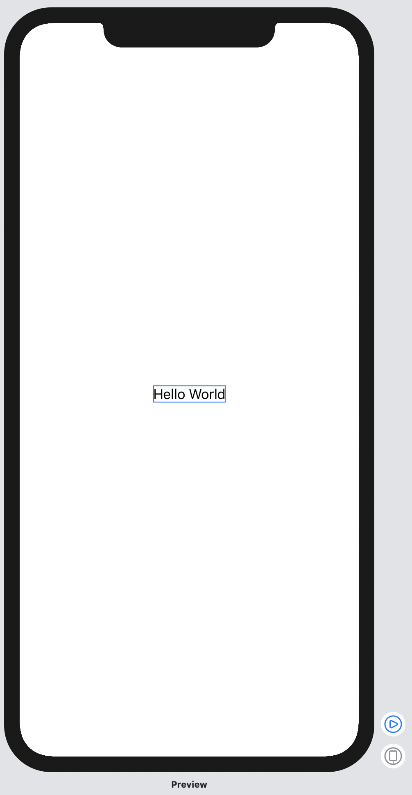
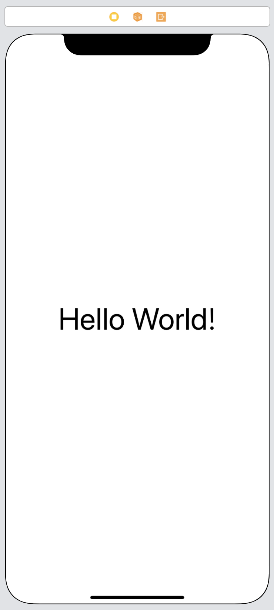

# SwiftUIとInterface Builder(Storyboard, xib, etc.)

# SwiftUIとInterface Builderの比較

SwiftUIとInterface Builderを知らない方に簡単に両方がどのようなものなのか説明をしたいと思います。

#### SwiftUI

SwiftUIはコードでUIを作成し、Previewで確認しながらFontや色の値の調整を行います。Previewはコードを変更するとリアルタイムに表示を更新してくれます。

Code

```Swift
struct SwiftUIView: View {
    var body: some View {
        Text("Hello World!")
    }
}
```

Preview



#### Interface Builder

Interface BuilderはUIコンポーネントをInterface Builder上にドラッグ&ドロップして、手動で大きさの制約などをつけます。その際XMLが生成されているのですが、基本的には触りません。

Preview



沢山省略してますが、XMLはこのようになってます

Code

```xml
<?xml version="1.0" encoding="UTF-8"?>
<document type="com.apple.InterfaceBuilder3.CocoaTouch.Storyboard.XIB" version="3.0" >
    <device id="retina6_1" orientation="portrait" appearance="light"/>
    <dependencies>
        <plugIn identifier="com.apple.InterfaceBuilder.IBCocoaTouchPlugin" version="14824"/>
        <capability name="Safe area layout guides" minToolsVersion="9.0"/>
        <capability name="documents saved in the Xcode 8 format" minToolsVersion="8.0"/>
    </dependencies>
    <scenes>
        <!--View Controller-->
        <scene sceneID="dmj-FK-dtb">
            <objects>
                <viewController id="OXh-1w-mEi" sceneMemberID="viewController" >
                    <view key="view" contentMode="scaleToFill" id="n1d-PG-aSR" >
                        <rect key="frame" x="0.0" y="0.0" width="414" height="896"/>
                        <autoresizingMask/>
                        <subviews>
                            <label opaque="NO" text="Hello World!">
                                ...
                            </label>
                        </subviews>
                        <color key="backgroundColor" systemColor="systemBackgroundColor"/>
                        <viewLayoutGuide key="safeArea" id="1sh-Xe-Wgw"/>
                    </view>
                </viewController>
                <placeholder placeholderIdentifier="IBFirstResponder" />
            </objects>
        </scene>
    </scenes>
</document>

```

[Interface Builderの欠点 >](2-disadvantage-of-interface-builder.md)