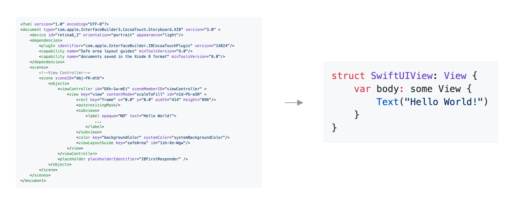

## SwiftUIで何が変わる？

まず、Storyboardの大きな欠点であったXMLでは無くSwiftを使ったUIの実装に変わり、格段に読みやすく、書きやすくなりました。Preview機能というのも実装されているのでSwiftを使ってUIの実装をしてもInterface Builderの時と同様にビルドをする前にUIの確認はすることができます。これによりUIのコードレビューをすることができるのも大きなメリットの一つです。

また、これまではiOSのアプリではUIKit、macOSのアプリはAppKitとUIのフレームワークが違った為、それぞれのアプリを作るにはそれぞれフレームワークを理解しないといけなかったのですが、SwiftUIはiOSとmacOSの両方で利用できるフレームワークとなっているので一度SwiftUIを勉強してしまえばiOSアプリからmacOSアプリへの以降は格段にやりやすくなってます。
これはWWDCでも話されていたのですが、SwiftUIが掲げているゴールは"Write once, run anywhere"では無く"Learn once, use anywhere"です。つまり、一つUIを実装すればiOS、macOS、tvOS、watchOS全てのOSで実行できるという考えよりは、一度 SwiftUIを覚えてしまえばその技術をiOS、macOS、tvOS、watchOS何処にでも応用できるという考えです。これは今までハードルの高かったmacOSアプリの作成やwatchOSアプリの作成のハードルを大きく下げてくれると思ってます。

[Xcode11のプロジェクト >](../3-xcode-11-setup/1-prepare-the-project.md)