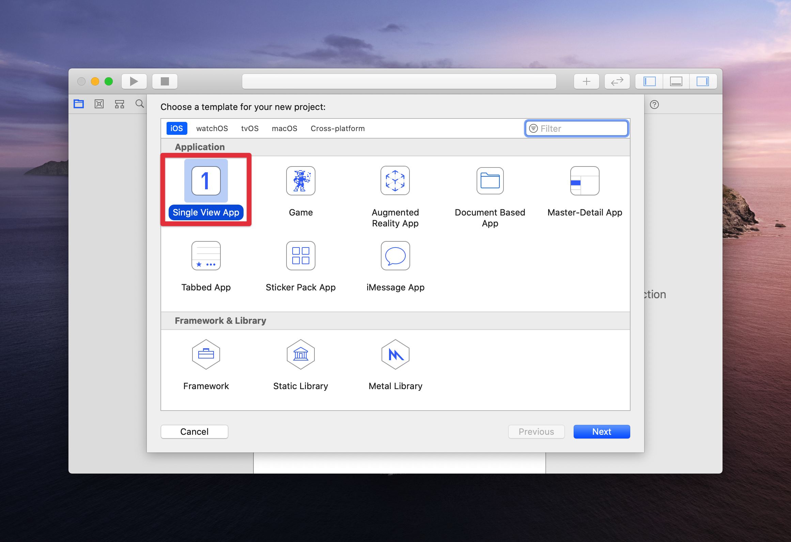
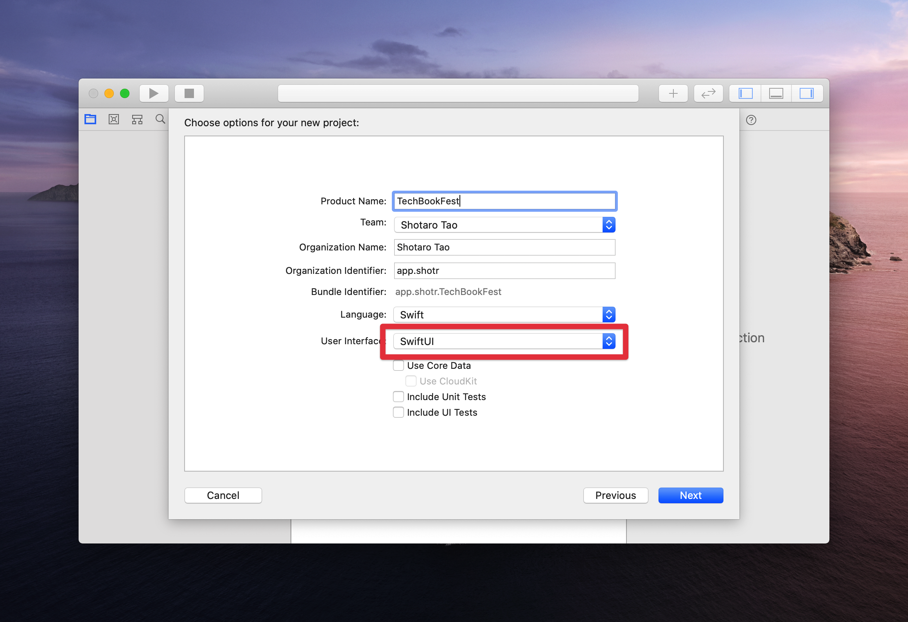

# Xcode11のプロジェクト

# プロジェクトの用意

Xcode 11を開き新規プロジェクトを作成します。

ここの選択肢はXcode 10の時とほとんど違いはありませんので、必要に応じてGameやTabbed Appなどを選択しても大丈夫です。
今回はSingle View Appを選択します。

続いて、アプリの名前等を入力します。この際必ず Use SwiftUI が選択されている事を確認してください。

[プロジェクトの見かた >](2-how-to-read-the-project.md)