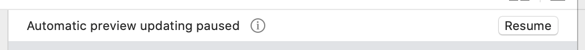
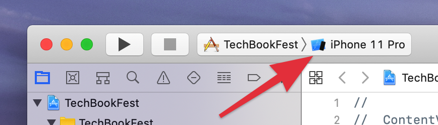

## プロジェクトの見かた

プロジェクトを開くと上のような画面になります。青い枠の部分がファイルの選択を行うプロジェクトナビゲーター、赤い枠の部分が選択したファイルの編集を行うエディタ、緑の枠の部分がSwiftUIで新しく追加されたPreview画面です。

プレビュー画面に上の画像のようにResumeというボタンが表示されていたら押すと今表示しているファイルのプレビュー画面が表示されるようになります。コードを編集していくとこの表示が出ることがあるので、覚えておきましょう。

プロジェクトの作成が完了しましたら、実行先にシミュレータが選択されている事を確認し▶︎ボタンをクリック又は⌘Rでビルドと実行をしてください。

[プロジェクトの説明 >](3-project-description.md)