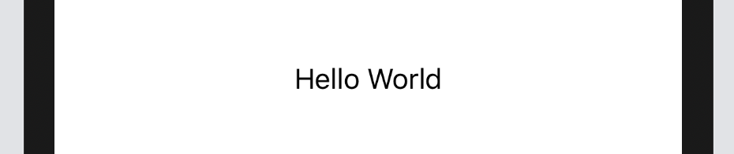

# Text

編集の行えないテキストを表示するView。

```Swift
var body: some View {
    Text("Hello World")
}
```



スタイルの変更は

```Swift
Text("Hello World")
    
    //太字、フォントの太さ
    .bold()
    .fontWeight(.heavy)
    
    //イタリック体
    .italic()
    
    //ベースラインのオフセット
    .baselineOffset(10)

    //文字のシフト、間隔を指定
    //両方指定した場合`tracking`が優先されます
    .kerning(5)
    .tracking(5)
    
    //下線
    .underline()

    //取り消し線
    .strikethrough()

    //テキストの揃え
    .multilineTextAlignment(.center)

    //行数（無限の場合はnil）
    .lineLimit(nil)
```

利用できる演算子

```Swift
// (Text, Text) -> Bool
Text("Hello World") == Text("Hello World") // true

// (Text, Text) -> Bool
Text("Hello World") != Text("Hello World") // false

// (Text, Text) -> Text
Text("Hello ") + Text("World").italic()
```

[TextField >](3-TextField.md)