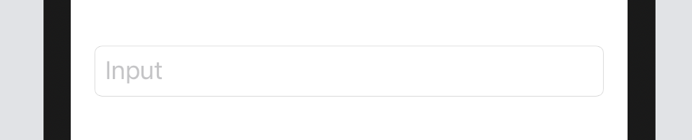

# TextField

文字列の編集が行えるテキストインターフェース。

```Swift
@State var input: String = ""

var body: some View {
    TextField("Input", text: $input)
}
```



スタイルの変更は

```Swift
TextField("Input", text: $input)

    //TextFieldのスタイル
    .textFieldStyle(PlainTextFieldStyle())
    .textFieldStyle(RoundedBorderTextFieldStyle())
    .textFieldStyle(SquareBorderTextFieldStyle())
    .textFieldStyle(DefaultTextFieldStyle())
```

### 実際のサンプルコードは[こちら](../../TechBookFest/TechBookFest/Views/TextFieldView.swift)

[SecureField >](4-SecureField.md)