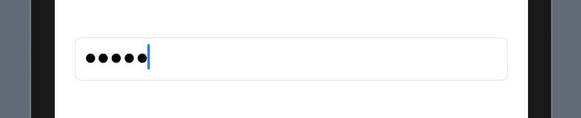

# SecureField

TextFieldと同じですが、入力した文字列が●で表示されます。
主にパスワードを入力するTextFieldです。

```Swift
@State var input: String = ""

var body: some View {
    SecureField("Input", text: $input)
}
```



### 実際のサンプルコードは[こちら](../../TechBookFest/TechBookFest/Views/SecureFieldView.swift)

[Image >](5-Image.md)